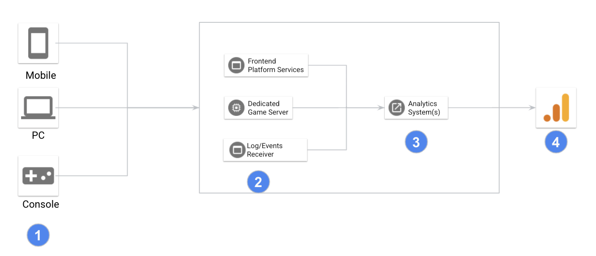

<walkthrough-project-setup>
</walkthrough-project-setup>

# GCP游戏分析解决方案
## 概述
常见的游戏分析系统架构如下图所示，一般会包含以下几个部分：
1. 游戏客户端：采集游戏日志、打点信息后，以实时或非实时方式发送到采集模块
2. 采集模块：认证游戏客户端，接收日志和打点信息，将接收到的数据存储到对应数据库或数据仓库
3. 分析系统：对数据进行ETL，将不同类型的数据处理后存放至不同类型的数据存储，计算汇总信息
4. 展现模块：根据业务关心的指标制作图表，可视化展现数据结果

## GCP架构
为了演示如何在GCP进行游戏数据分析，设计了一个简单的架构用于展示如何从游戏客户端采集数据，如何将数据实时发送至服务端，如何实时存储和处理数据并进行可视化展现。

此架构包含两类数据的采集和处理：用户事件的实时处理和日志的批量处理。

#### 用户事件实时处理

用户登陆游戏、购买虚拟资产、充值等行为我们将其定义为`事件`,除上述通用行为外，我们还可为特定游戏定义特定的事件，如：用户升级、加入工会、获得装备等。如何定义游戏事件，请参考：[Google Analytics推荐事件](https://support.google.com/firebase/answer/9267735?hl=zh-Hans&ref_topic=6317484)  和 [GA推荐的游戏事件](https://support.google.com/firebase/answer/9267565?hl=zh-Hans)

用户事件具有实效性，如果能尽快的采集和处理用户事件，能改善用户体验，提高玩家留存率。例如：当玩家卡在某一关卡无法过关，当服务端接收到几条事件后，为玩家提供过关指引。

[Cloud Pub/Sub](https://cloud.google.com/pubsub) 为玩家事件采集提供了托管的消息队列服务，游戏客户端集成SDK之后可将玩家事件发送至Cloud Pub/Sub。Cloud Pub/Sub是一个全球化的服务，Google在全球范围跟大多数网络服务提供商(ISP)都有peering，无论玩家所在何处，都能够快速的将玩家事件发送到Cloud Pub/Sub。

玩家事件发送到Cloud Pub/Sub之后，通过[Dataflow](https://cloud.google.com/dataflow) 作为消费者获取数据，进行ETL操作之后保存到[BigQuery](https://cloud.google.com/bigquery) 。整条处理采集和处理的管道(Pipeline)不需要游戏开发者部署服务器来安装应用，免去了运维负担。并且数据管道的处理能力可以根据玩家事件数据量的变化而弹性扩展，让游戏开发者按使用量付费。